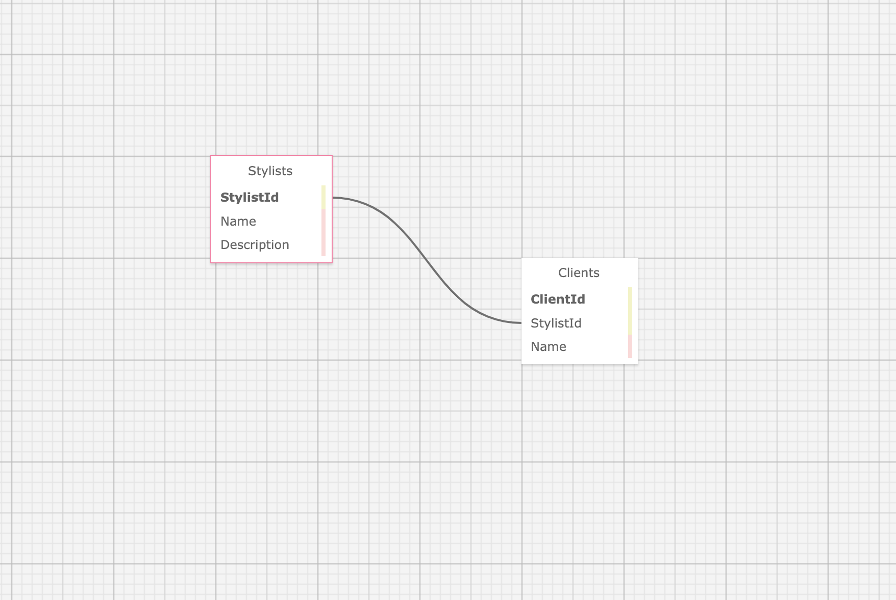

# _Hair Salon_

#### By _**Ben Goodrow**_

#### _This is a simple C# database project. _

## Technologies Used

* Git
* C#
* .NET 6.0
* ASP.NET
* RESTful Routing
* Entity Framework Core
* MVC
* BootStrap
* MySQL Workbench
* Razor view Engine

## Description

_This is a C# MVC application to keep track of a Salon's Clients. This application use two tables in the schema of ben_goodrow and it is managed by the MySQL workbench.

## Setup/Installation Requirements

* _Open your terminal_

* _Access MySQL by executing the command mysql -uroot -pepicodus in the terminal.
* _Open MySQLWorkBench and import SQL schema file included in root directory.
* _Clone this project with the following commands $ git clone https://github.com/bpgoodrow/HairSalon.Solution_
* _Navigate to the root of the directory you want to save the project_
* _Open project in the command $ code ._
* _Navigate to the sub-directory of the project $ cd HairSalon_
* _Restore and install packages listed in the csproj in the command $ dotnet restore_
* _Build your dependencies in your command $ dotnet build_
* _Next we will execute this compiled code in command $ dotnet run_

## Known Bugs

N/A

## License

MIT

Copyright <2022>

Permission is hereby granted, free of charge, to any person obtaining a copy of this software and associated documentation files (the "Software"), to deal in the Software without restriction, including without limitation the rights to use, copy, modify, merge, publish, distribute, sublicense, and/or sell copies of the Software, and to permit persons to whom the Software is furnished to do so, subject to the following conditions:

The above copyright notice and this permission notice shall be included in all copies or substantial portions of the Software.

THE SOFTWARE IS PROVIDED "AS IS", WITHOUT WARRANTY OF ANY KIND, EXPRESS OR IMPLIED, INCLUDING BUT NOT LIMITED TO THE WARRANTIES OF MERCHANTABILITY, FITNESS FOR A PARTICULAR PURPOSE AND NONINFRINGEMENT. IN NO EVENT SHALL THE AUTHORS OR COPYRIGHT HOLDERS BE LIABLE FOR ANY CLAIM, DAMAGES OR OTHER LIABILITY, WHETHER IN AN ACTION OF CONTRACT, TORT OR OTHERWISE, ARISING FROM, OUT OF OR IN CONNECTION WITH THE SOFTWARE OR THE USE OR OTHER DEALINGS IN THE SOFTWARE.